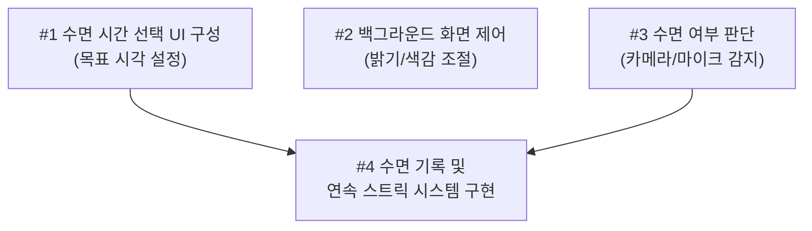

# 5주차 활동지 / Week 5 Worksheet

**1-page 기획서 / One-page plan**

- 작성일 / Date: 2026-09-30
- 참여자 / Present: 김현우, 박영욱

---

## ① 주제 확정 / Confirm topic

- 확정 주제 / Topic: 잠들기 쉽게 도와주고 숙면할 수 있게 도와주는 어플리케이션.
- 이유 / Reason: 휴대폰 사용이 필수인 현대인들의 수면의 질을 향상시키기 위함.

---

## ② 태스크 분해와 의존 관계 / Tasks and dependencies

### 태스크 목록 / Task list

4주차 사용자 스토리와 완료 조건을 태스크로 나눕니다.
*Break down your Week 4 user stories and acceptance criteria into tasks.*

사용자가 게임을 어플리케이션을 실행 중인 동안 사용자의 수면 여부를 주기적으로 판단한다.

*Each task must be checkable on its own. Do not write "everyone" as owner.*

| # | 태스크 Task | 완료 조건 Done when | 선행 태스크 Depends on | 담당 Owner |
|---|---|---|---|---|
| 1 | 사용자가 원하는 수면 시간을 선택할 수 있는 화면 구성 | 화면에 사용자가 원하는 목표 수면 시각을 설정할 수 있는 UI 표시 | - |김현우, 박영욱|
| 2 | 어플리케이션 백그라운드 실행 동안 화면 밝기와 색감을 수면에 적합하도록 변경 | 화면 휘도 5nits 이하, 조도 1lux 이하, 색온도 2000K 이하로 조절 | - |김현우, 박영욱|
| 3 | 사용자가 잠에 들었는지 판단 | 스마트폰 전면 카메라를 통해 사용자의 눈 감김 여부를 감지하고, 마이크를 통해 수면 소음이 30~40dB 이하인지 판단 |  |김현우, 박영욱|
| 4 | 사용자가 목표 시각에 잠에 든 날을 기록, 연속 스트릭 시스템 구현 | 설정된 목표 시각과 수면 판별 시점을 비교하여 성공 여부를 저장하고, 연속 달성 일수(Streak)를 화면에 업데이트 표시 | 1, 3 |김현우, 박영욱|

### 의존 관계 그래프 / Dependency graph (DAG)
화살표는 "앞 태스크가 끝나야 뒤 태스크를 할 수 있다"는 뜻입니다.
*An arrow means the first task must finish before the second can start.*

**그리는 방법 / How to draw**
- 아래 예시에서 상자 이름을 바꾸고, 선후 관계 하나마다 화살표(`-->`) 줄을 하나씩 추가합니다. GitHub에서 파일을 열면 그림으로 보입니다. 미리 보려면 mermaid.live에 붙여 넣으세요.
  *Rename the boxes and add one `-->` line per dependency. GitHub shows it as a diagram. Preview at mermaid.live.*
- 태스크 표를 AI에게 주고 "Mermaid 그래프로 바꿔 줘"라고 요청해도 됩니다.
  *You can also give the task table to AI and ask "Convert this into a Mermaid graph."*
- 어려우면 종이에 그려 사진을 `docs/images/`에 올리고 ``로 넣어도 됩니다.
  *Or draw it on paper, upload the photo to `docs/images/` and link it with ``.*

- 지금 착수 가능 (진입 차수 0) / Can start now (in-degree 0): 
- 작업 순서 (위상정렬) / Work order (topological sort): 
- 사이클이 있었다면 어떻게 풀었는가 / If there was a cycle, how did you fix it?: 

---

## ③ 범위 결정 / Scope

### Must — 없으면 성립 안 됨 / essential

핵심 시나리오 1개가 끝까지 동작하는 데 필요한 것만 / *Only what the core scenario needs to work end-to-end*

- 핵심 시나리오 / Core scenario: 

 사용자가 목표 수면 시각을 설정하고 앱을 실행하면, 백그라운드에서 수면에 적합한 디스플레이(저휘도·저색온도)로 전환되며, 센서(카메라/마이크)로 수면 상태를 감지하여 목표 시각 내 수면 성공 시 연속 학습일(Streak)을 기록·갱신한다.

### Should (없을 경우에는 작성하지 마세요)
 
 - 시나리오

### Could (없을 경우에는 작성하지 마세요)

 - 시나리오

### **Won't — 이번 학기에 안 함 / not this semester**

| Won't 항목 Item | 포기한 이유 Why |
|---|---|
| 수면을 도와주는 게임 | 게임 보상의 디자인과 레벨 디자인을 한 학기 내에 해낼 수 없음 |
| 상세한 수면 소음 분석 | 수면 중 발생하는 숨소리를 코골이, 뒤척임, 외부소음으로 구분하는 시스템 구현이 어려움 |

### 실행 가능성 확인 / Feasibility check

- 특수 장비·유료 API·실제 개인정보가 필요한가? 필요하다면 대안은?
  *Does it need special hardware, paid APIs or real personal data? If so, what is the alternative?*
- 15주차에 발표장에서 시연할 수 있는 형태인가?
  *Can it be demonstrated live in Week 15?*

---

## ④ 가장 먼저 동작시킬 흐름 (Walking Skeleton) / First end-to-end flow

예 / Example: 과제 ID를 입력하면 → LMS에서 제출 기록을 받아 와서 → 화면에 제출 인원 숫자 하나가 뜬다

> [무엇을 입력하면] → [무엇을 처리해서] → [화면에 무엇이 나온다]
> [사용자가 수면 시각을 설정하면] → [전방 카메라와 마이크로 받은 정보로] → [사용자의 수면 여부를 판단한다.]

---

> 수업 종료 시 커밋하세요 / Commit this at the end of class
> `git add docs/week-05.md && git commit -m "docs: 5주차 활동지 작성"`
